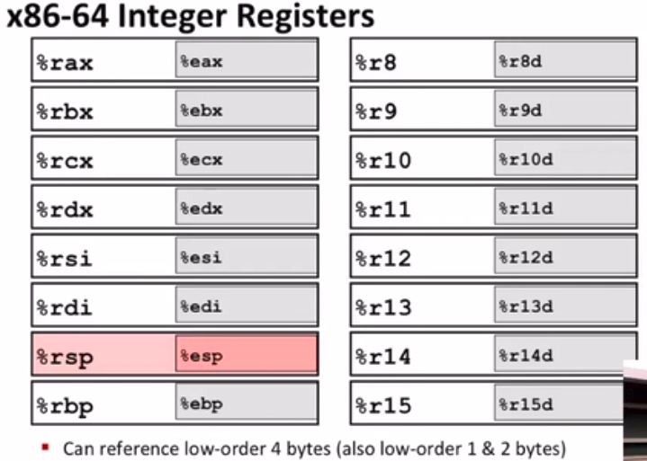
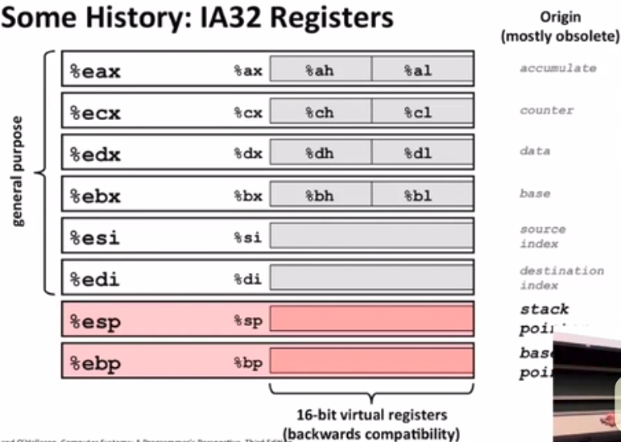

Machine-Level Programming I: Basic

英特尔发展史 -- 大事记

>
    名称        日期        晶体管      MHz
    8086        1978        29K         5-10
    386         1985        275K        16-33
    Pentium 4E  2004        125M        2800-3800
    Core 2      2006        291M        1060-3500
    Core i7     2008        731M        1700-3900

`gcc -Og -S sum.c`

-S: 让编译程序在生成汇编语言输出之后立刻停止。

-O0：（optimize）不做任何优化，这是默认的编译选项。

-Og: 使用全局优化，启用不会影响调试的优化。

`objdump -d sum > sum.d` 反汇编sum中的需要执行指令的那些section，并将结果重定向到sum.d

启用gdb`gdb sum`

在(gdb)后面输入`disassemble sumstore`反汇编sumstore函数

---

x86-64寄存器:
`%r` 64位 `%e` 32位





---


比如：
```c
void swap(long *xp,long *yp){
    long to = *xp;
    long t1 = *yp;
    *xp = t1;
    *yp = t0;
}
```

对应的汇编代码:
```
swap:
    movq (%rdi),%rax
    movq (%rsi),%rdx
    movq %rdx,(%rdi)
    movq %rax,(%rsi)
```

---

好，继续做题吧，下面是地址计算的题。

```
%rdx = 0xf000
%rcx = 0x0100
```

>
    表达式           地址计算          地址
    0x8(%rdx)       0xf000+0x8      0xf008
    (%rdx,%rcx)     0xf000+0x0100   0xf100
    (%rdx,%rcx,4)   0xf000+4*0x0100 0xf400
    0x80(,%rdx,2)   2*0xf000+0x80   0x1e080

---

不知道为什么x86-64的movq和自己老师讲的8086的mov，目的数和原操作数是反的？

然后8086的取内存是`[Reg]`,而x86-64是`(Reg)`,还有就是8086寻址没有scale这一项，8086的lea(load effective address)也没有leaq强大

> 
    例1 假设：SI=1000H , DS=5000H, (51000H)=1234H
    　　执行指令 LEA BX , [SI]后，BX=1000H
    　　执行指令 MOV BX , [SI]后，BX=1234H

    他们都取TABLE的偏移地址，然后送到BX中，即
        LEA BX,TABLE
        MOV BX,OFFSET TABLE

    某数组含20个元素，每个元素占一个字节，序号为0~19。
    设DI指向数组开头处，如果把序号为6的元素的偏移地址送到BX中
        LEA BX, 6[DI]

---

再看一个例子吧！(恐怖的事情发生了，我开-Og优化，真的生成了下面的汇编，太智能了吧！)

```c
long arith(long x,long y,long z){
    long t1 = x+y;
    long t2 = z+t1;
    long t3 = x+4;
    long t4 = y*48;
    long t5 = t3+t4;
    long rval = t2*t5;
    return rval;
}
```

```
%rdi -- argument x
%rsi -- argument y
%rdx -- argument z
%rax -- t1,t2,rval
%rdx -- t4
%rcx -- t5
```

```
aritch
    leaq    (%rdi,%rsi),%rax    # t1
    addq    %rdx,%rax           # t2
    leaq    (%rsi,%rsi,2),%rdx  # 3*%rsi => %rdx
    salq    $4,%rdx             # %rdx*16   t4
    leaq    4(%rdi,%rdx),%rcx   # t5
    imulq   %rcx,%rax           # rval
```


参考博客: `https://blog.csdn.net/baidu_41667019/article/details/84678407`