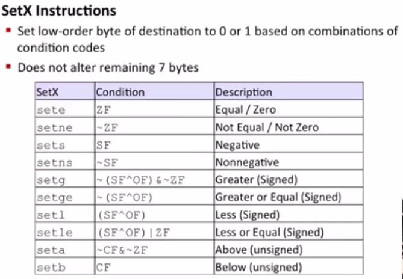
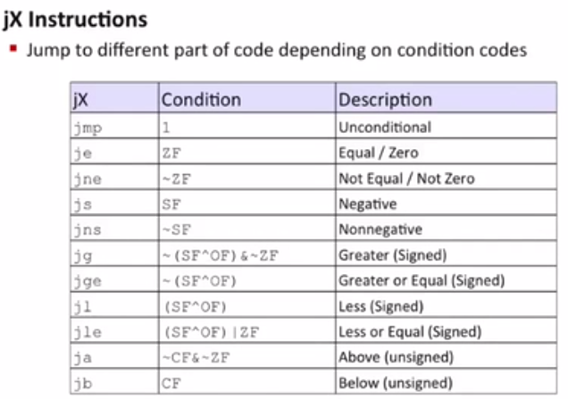

# Machine-Level Programming II: Control

条件码 比如： addq Src,Dest <---> t = a+b
>
    CF 被设置当unsigned overflow
    ZF 被设置当t==0
    SF 被设置当t<0 (as signed)
    OF 被设置当signed overflow (a>0 && b>0 && t<0) ||  (a<0 && b<0 && t>=0)

8086的条件码
>
    CF（carry flag）:进位标志 描述了最近操作是否发生了进位（可以检查无符号操作是否溢出）
    ZF（zero flag）:零标志 最近操作结果为0（列如 逻辑操作 等）
    SF（sign flag）:符号标志最近操作结果为负数
    OF（overflow flag）:溢出标志最近操作导致一个补码溢出 补码溢出通常有两种结果（正溢出或者负溢出）

    PF:奇偶标志位。相关指令执行后结果所有bit中1的个数为偶数，那么PF=1，1的个数为奇数则PF=0；
    AF:辅助进位标志位。运算过程中看最后四位，不论长度为多少。最后四位向前有进位或者借位，AF=1,否则AF=0;
    TF:调试标志位。当TF=1时，处理器每次只执行一条指令，即单步执行;
    IF:中断允许标志位。它用来控制8086是否允许接收外部中断请求。若IF=1，8086能响应外部中断，反之则屏蔽外部中断;
    DF:方向标志位。在串处理指令中，每次操作后，如果DF=0，si、di递增，如果DF=1，si、di递减；注意此处DF的值是由程序员进行设定的 cld命令是将DF设置为0，std命令是将DF设置为1；

`test b,a` a和b取与，结果不保存到a
>
    ZF set when a&b == 0
    SF set when a&b < 0






继续看例子吧！读者一定去linux下用`gcc -Og -S`测试下

```c
int gt(long x,long y){
    return x > y;
}
```

```
gt:
	cmpq	%rsi, %rdi      # %rdi -- x ,%rsi -- y
	setg	%al             # set when >
	movzbl	%al, %eax       # %rax的剩余位赋0
	ret
```

---

```c
long absdiff(long x,long y){
    long result;
    if(x > y)
        return x - y;
    else
        return y - x;
    return res;
}
```

```
gt:
	cmpq	%rsi, %rdi      # %rdi -- x ,%rsi -- y
	setg	%al             # set when >
	movzbl	%al, %eax       # %rax的剩余位赋0
	ret
```