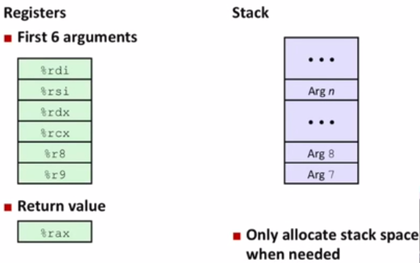

# Machine-Level Programming III: Procedures

stack pointer : `%rsp`

当向栈添加数据时，栈指针地址递减。

调用call

1) 减少栈指针，例如`%rsp 0x120 - 8 => 0x118`
2) 将要当前指令的地址写入栈顶
3) 程序计数器(`%rip`)被设置为将要执行的指令的地址

ret

1) 取出栈顶存储的值。
2) 增加栈指针。
3) 程序计数器(`%rip`)被设置为取出的栈顶的值

约定调用函数的寄存器存储数据，只针对与整数和指针

