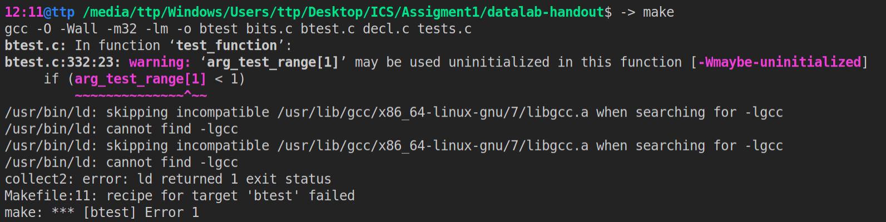

datalab-handout     我的任务记录
datalab-handout.tar 原压缩包，解压方法`tar xvf datalab-handout.tar`
README.md           该文件

错误解决：

1) 出现该错误，执行`sudo apt-get install gcc-multilib`

小技巧：

1） 常数只允许(only 0x0 - 0xff allowed)

>
    1 << 31;    // 0x80...0

    int my_0xAAAA = 0xaa | (0xaa << 8);
    int my_0xAAAAAAAA = my_0xAAAA | (my_0xAAAA << 16); // 构造0xAAAAAAAA
    